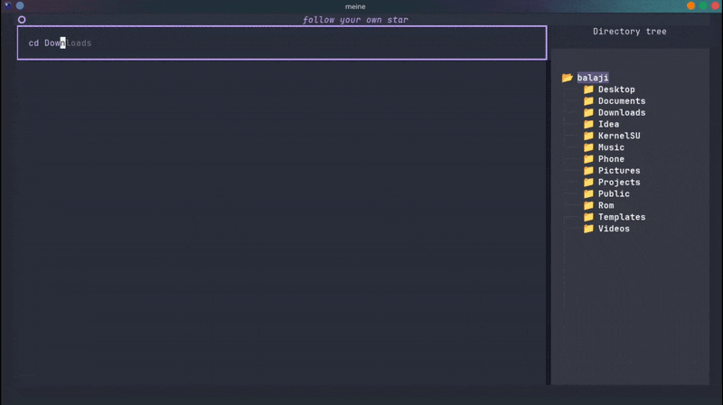

<h1 align="center">MEINE 🌒</h1>

<div align="center">

<a href="https://github.com/Balaji01-4D/meine/stargazers"></a>
<a href="https://github.com/Balaji01-4D/meine/network/members"></a>
<a href="https://github.com/Balaji01-4D/meine/pulls"></a>
<a href="https://github.com/Balaji01-4D/meine/issues"></a>
<a href="https://github.com/Balaji01-4D/meine/graphs/contributors"></a>
<a href="https://github.com/Balaji01-4D/meine/blob/master/LICENSE"></a>



<i>Loved the project? Please consider <a href="https://ko-fi.com/balaji01">donating</a> to help it improve!</i>

</div>


## 🚀 Features

- **🔍 Regex-Based Command Parsing**
  Use intuitive commands to delete, copy, move, rename, search, and create files or folders.

- **🗂️ TUI Directory Navigator**
  Browse your filesystem in a reactive terminal UI—keyboard and mouse supported.

- **💬 Live Command Console**
  A built-in shell for interpreting commands and reflecting state changes in real time.

- **⚡ Asynchronous & Modular**
  Built with `asyncio`, `aiofiles`, `py7zr`, and modular architecture for responsive performance.

- **🎨 Theming & Config**
  CSS-powered themes, JSON-based user preferences, and dynamic runtime settings.

- **📊 System Dashboard**
  Real-time system insights via one-liner commands:
  `cpu`, `ram`, `battery`, `ip`, `user`, `env`, and more.

- **🧩 Plugin Ready**
  Drop in your own Python modules to extend functionality without altering core logic.

---
## 📸 Screenshots

<p align="center">
  
  

</p>

<p align="center">
  <b>Input Shell</b> &nbsp;&nbsp;&nbsp;&nbsp;&nbsp;&nbsp;&nbsp;&nbsp;&nbsp;&nbsp; <b>Settings screen</b>
</p>

<p align="center">
  
</p>

<p align="center"><b>System widget (inspired by Neofetch)</b></p>


<p align="center">
  
</p>

<p align="center"><b>Dynamic Suggestions</b></p>

<p align="center">
  
</p>

<p align="center"><b>Battery widget</b></p>

<p align="center">
  
</p>

<p align="center"><b>RAM widget</b></p>

<p align="center">
  
</p>

<p align="center"><b>CPU widget</b></p>

---

## 🛠️ Installation

**Install via pip**
> Requires Python 3.10+

```bash
pip install meine
```

Or clone the repo:

```bash
git clone https://github.com/Balaji01-4D/meine
cd meine
pip install .
```

---

## 🔤 Regex-Based Commands

| Action      | Syntax Example                                  |
|-------------|--------------------------------------------------|
| **Delete**  | `del file.txt`  ·  `rm file1.txt,file2.txt`     |
| **Copy**    | `copy a.txt to b.txt` · `cp a1.txt,a2.txt to d/`|
| **Move**    | `move a.txt to d/` · `mv f1.txt,f2.txt to ../`  |
| **Rename**  | `rename old.txt as new.txt`                      |
| **Create**  | `mk file.txt` · `mkdir folder1,folder2`         |
| **Search**  | `search "text" folder/` · `find "term" notes.md` |

---


